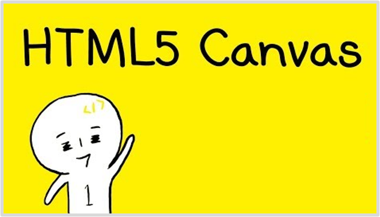

<!-- PROJECT LOGO -->
 

  
  <h3>Canvas 라이브 강좌</h3>
  <small>✍ Lectured by <b>1분코딩</b></small>
   
  <small>📆 Will Study Soon <b></b></small>

 

## 📄 리뷰

(추후 작성)

## ✅ 목차

| 강의  |                                                               제목                                                                | 공부 날짜 |
| :---: | :-------------------------------------------------------------------------------------------------------------------------------: | :-------: |
|   1   | [HTML5 Canvas 캔버스 라이브 강좌 #1](https://www.youtube.com/watch?v=JFQOgt5DMBY&list=PLe9WXHRkq9p2Yl0z2zskv-FhP5sinISTc&index=1) |           |
|   2   | [HTML5 Canvas 캔버스 라이브 강좌 #2](https://www.youtube.com/watch?v=ovf8cbKtBH0&list=PLe9WXHRkq9p2Yl0z2zskv-FhP5sinISTc&index=2) |           |
|   3   | [HTML5 Canvas 캔버스 라이브 강좌 #3](https://www.youtube.com/watch?v=p8TsTUJj-kY&list=PLe9WXHRkq9p2Yl0z2zskv-FhP5sinISTc&index=3) |           |
|   4   |       [HTML5 Canvas 캔버스 라이브 강좌 #4](youtube.com/watch?v=IeN-m2hMO-g&list=PLe9WXHRkq9p2Yl0z2zskv-FhP5sinISTc&index=4)       |           |
|   5   | [HTML5 Canvas 캔버스 라이브 강좌 #5](https://www.youtube.com/watch?v=hBTwJGZIrSo&list=PLe9WXHRkq9p2Yl0z2zskv-FhP5sinISTc&index=5) |           |
|   6   | [HTML5 Canvas 캔버스 라이브 강좌 #6](https://www.youtube.com/watch?v=hZCHBqpjFDc&list=PLe9WXHRkq9p2Yl0z2zskv-FhP5sinISTc&index=6) |           |
